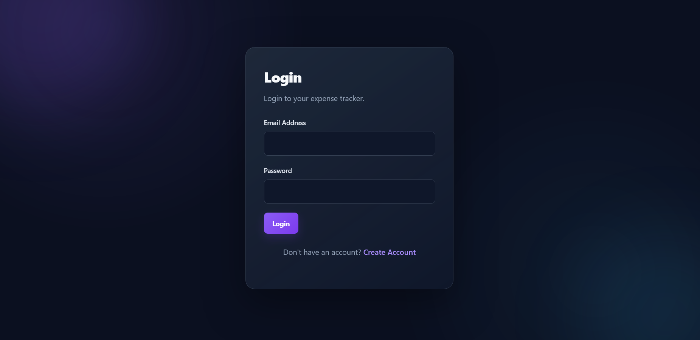
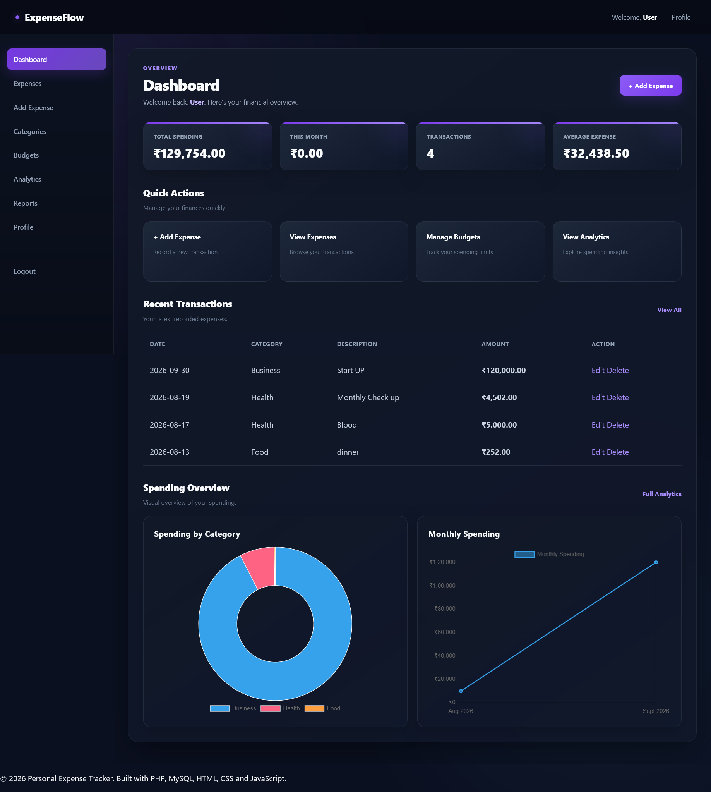
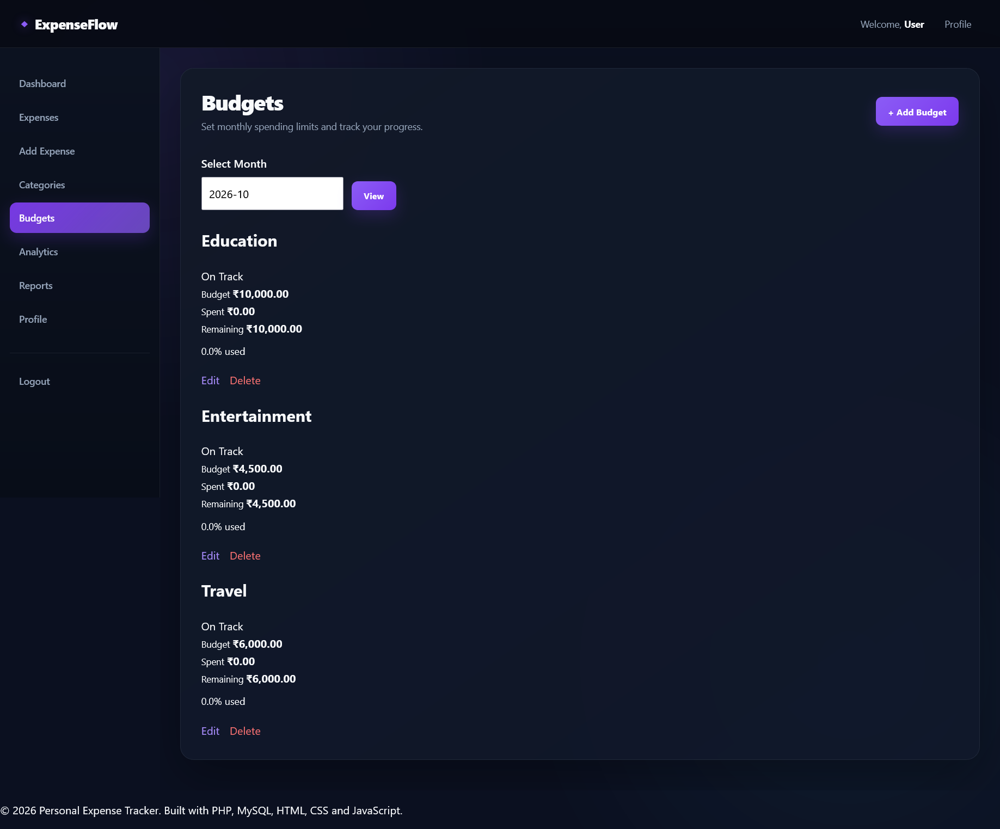
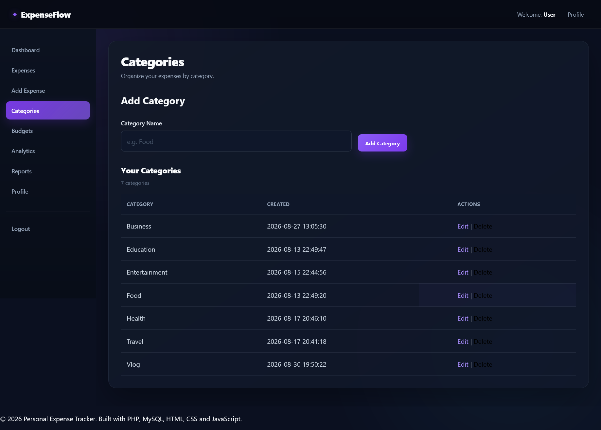

Personal Expense Tracker

A web-based Personal Expense Tracker built with PHP and MySQL that helps users record expenses, organize spending into categories, create monthly budgets, and analyze their financial activity through dashboards and visualizations.

Overview

The Personal Expense Tracker provides a simple web interface for managing personal expenses and monitoring spending against category-based monthly budgets.

The application follows a structured PHP architecture with PDO, session-based authentication, database-backed expense management, budget tracking, and JavaScript-based data visualization.

Features

User Authentication

- User registration
- User login and logout
- Session-based authentication
- Protected pages for authenticated users

Expense Management

- Add expenses
- View expenses
- Edit expenses
- Delete expenses
- Assign expenses to categories
- Record expense dates and amounts
- Manage expense information

Category Management

- Create expense categories
- View categories
- Edit categories
- Delete categories
- Prevent deletion of categories that are already associated with expenses

Budget Management

- Create monthly budgets
- View budgets
- Edit budgets
- Delete budgets
- Assign budgets to categories
- Track spending against budgets
- Calculate remaining budget
- Calculate budget usage percentage
- Display budget status

Budget statuses include:

- On Track
- Almost Used
- Over Budget

Dashboard

The dashboard provides an overview of the user's financial activity, including:

- Total expenses
- Current-month spending
- Budget information
- Category-based spending information
- Transaction summaries
- Financial activity overview

Analytics

The analytics section provides spending statistics and visualizations, including:

- Total spending
- Current-month spending
- Total number of transactions
- Average expense
- Highest expense
- Current-month transaction count
- Spending by category
- Monthly spending trends
- Interactive charts

Reports & Data Export

The application provides report and data-export functionality through its API endpoints.

Receipt Uploads

The project includes support for storing expense receipt files.

Screenshots

## Screenshots

### Login

### Dashboard

### Expense Management

### Budget Management

### Category Management

### Analytics

Technologies Used

Backend

- PHP
- MySQL
- PDO

Frontend

- HTML5
- CSS3
- JavaScript

Data Visualization

- Chart.js

Development Tools

- Git
- GitHub
- Composer
- Visual Studio Code
- XAMPP

Architecture

The application uses a structured PHP architecture with separate responsibilities for:

- Database access
- Authentication
- Business logic
- Page-level functionality
- API endpoints
- Frontend assets

Database operations are handled through PDO and prepared statements.

Project Structure

personal-expense-tracker/
│
├── api/
│   ├── export_data.php
│   ├── get_chart_data.php
│   └── get_expense_summary.php
│
├── assets/
│   ├── css/
│   │   ├── dashboard.css
│   │   └── style.css
│   │
│   ├── images/
│   │   └── logo.png
│   │
│   └── js/
│       ├── ajax.js
│       ├── charts.js
│       ├── dashboard.js
│       └── validation.js
│
├── classes/
│   ├── Analytics.php
│   ├── Budget.php
│   ├── Category.php
│   ├── Database.php
│   ├── Expense.php
│   └── User.php
│
├── config/
│   ├── config.php
│   └── database.php
│
├── database/
│   ├── expense_tracker.sql
│   └── seed_data.sql
│
├── includes/
│   ├── auth.php
│   ├── auth_check.php
│   ├── footer.php
│   ├── functions.php
│   ├── header.php
│   ├── navbar.php
│   └── sidebar.php
│
├── logs/
│   └── .gitkeep
│
├── pages/
│   ├── add_budget.php
│   ├── add_expense.php
│   ├── analytics.php
│   ├── budgets.php
│   ├── categories.php
│   ├── dashboard.php
│   ├── delete_budget.php
│   ├── delete_expense.php
│   ├── edit_budget.php
│   ├── edit_category.php
│   ├── edit_expense.php
│   ├── expense.php
│   ├── logout.php
│   ├── profile.php
│   └── reports.php
│
├── tests/
│   └── ExpenseTest.php
│
├── uploads/
│   └── receipts/
│
├── .env.example
├── .gitignore
├── composer.json
├── composer.lock
├── index.php
├── LICENSE
├── login.php
├── README.md
└── register.php

Database Setup

The project contains the required SQL files in the "database/" directory:

database/
├── expense_tracker.sql
└── seed_data.sql

These files can be imported into MySQL to create the database structure and sample/initial data.

Environment Configuration

The application uses environment variables for local configuration.

Create a local ".env" file based on:

.env.example

The ".env" file is intentionally excluded from Git through ".gitignore" and should never be committed to the public repository.

Installation & Setup

1. Install XAMPP

Install XAMPP with:

- Apache
- MySQL

2. Clone the Repository

Place the project inside the XAMPP "htdocs" directory:

xampp/htdocs/personal-expense-tracker

3. Install PHP Dependencies

If Composer dependencies are required, run:

composer install

4. Create the Database

Open phpMyAdmin and create the required MySQL database.

Import:

database/expense_tracker.sql

If required by the project setup, also import:

database/seed_data.sql

5. Configure Environment Variables

Create:

.env

using ".env.example" as a reference.

Configure the local database credentials according to your XAMPP/MySQL installation.

6. Start XAMPP

Start:

Apache
MySQL

7. Run the Application

Open the application in your browser using the appropriate localhost path:

http://localhost/personal-expense-tracker/

Security

The project includes several security-oriented practices:

- Session-based authentication
- Protected pages for authenticated users
- PDO prepared statements for database operations
- CSRF protection for applicable forms
- Password hashing
- Environment-based configuration
- ".env" excluded from version control
- Input validation and sanitization
- Authorization checks for protected operations

Testing

The project includes a test file for expense-related functionality:

tests/ExpenseTest.php

GitHub Workflow

The project uses Git for version control and is maintained as a separate GitHub repository.

Typical workflow:

Modify Code
     ↓
Test Locally
     ↓
git add
     ↓
git commit
     ↓
git push

Future Improvements

Potential future enhancements include:

- Advanced financial reports
- More detailed analytics
- Recurring expenses
- Recurring budgets
- Improved receipt management
- Export customization
- Email notifications
- Cloud deployment
- Automated test coverage
- REST API expansion
- Mobile-friendly enhancements

Project Purpose

This project demonstrates practical experience with:

- PHP web development
- MySQL database management
- Object-oriented PHP
- PDO
- CRUD operations
- Authentication and authorization
- Session management
- CSRF protection
- Budget management
- Expense tracking
- Data visualization
- API endpoints
- Git and GitHub
- Responsive web application development

Author

Akash Kumar

MCA Graduate | Software Development & IT

This project is part of my software development portfolio and demonstrates practical experience in PHP, MySQL, JavaScript, database-driven applications, and web application development.